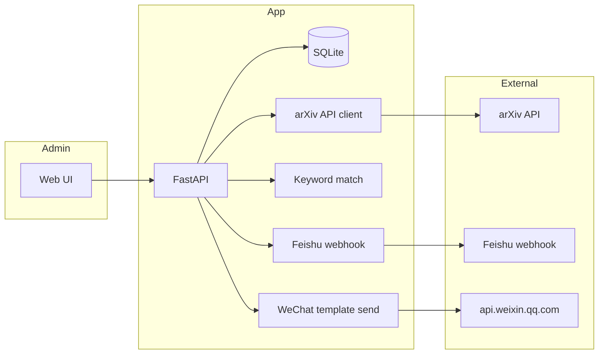

# arXiv daily digest (Feishu + WeChat 公众号)

## Goals

- Run on a **small cloud VPS** with clear **environment configuration**.
- **Backend** + **frontend**: you configure **keywords** and **who receives pushes** (Feishu groups via webhook URLs; WeChat users via **openid** under one Official Account).
- **Paper source**: use the **official arXiv API** (not HTML crawling)—stable, polite, gives title, abstract, authors, dates, abs/PDF links.
- **Digest rule**: only papers whose arXiv **date** (see below) falls on the **previous calendar day** in `**Asia/Shanghai`**, and that **match your keywords** on title/abstract.
- **Schedule**: **once per day** at **12:00 noon Beijing time** (`Asia/Shanghai`).
- If **no** papers match that digest day, **send nothing** by default (optional “no matches” line later).

## Digest date and schedule (fixed product rules)


| Rule                     | Value                                                                                                                                   |
| ------------------------ | --------------------------------------------------------------------------------------------------------------------------------------- |
| Timezone for “which day” | `Asia/Shanghai`                                                                                                                         |
| Run time                 | Every day **12:00** local                                                                                                               |
| Which papers             | `**digest_date` = yesterday** in `Asia/Shanghai` at run time (e.g. Monday noon → Sunday’s papers in Beijing date)                       |
| Paper date field         | Use API **published** (or first-version equivalent); convert from API UTC to `Asia/Shanghai` and compare calendar date to `digest_date` |
| No rolling 24h window    | Avoid mixing two calendar days                                                                                                          |


**Idempotency**: persist **digest_runs** with `**digest_date`** (Beijing) per channel/target so a duplicate `POST /api/digest/run` the same day does not double-send.

## Channels

### Feishu / Lark

- Add a **group bot** with an **incoming webhook**; store **webhook URL** per push target (secret). POST JSON—no OAuth for basic group push.

### WeChat Official Account (公众号)

- Users must **follow** the account. You need **appid**, **secret**, **template_id** from [微信公众平台](https://mp.weixin.qq.com), and each user’s **openid**.
- Backend caches **access_token** (~2h), calls template send API; **data** keys must match your template placeholders in MP admin.
- **openid** collection: OAuth/QR later; MVP **paste openids** from MP tools—document in README.
- Respect template length limits; may truncate, aggregate, or split messages—pick one strategy and document.

## Architecture




## Stack


| Layer     | Choice                                                                                                                                                                         |
| --------- | ------------------------------------------------------------------------------------------------------------------------------------------------------------------------------ |
| API       | **FastAPI** + **uvicorn**                                                                                                                                                      |
| DB        | **SQLite** (path under `/root/apps` or volume)                                                                                                                                 |
| UI        | **Vite** + **React** (or Vue)—forms for keywords, targets, test/run                                                                                                            |
| Scheduler | **systemd.timer** with `Timezone=Asia/Shanghai` `OnCalendar=*-*-* 12:00:00` → `curl` `POST /api/digest/run` with auth header; or **cron** `CRON_TZ=Asia/Shanghai` `0 12 * * `* |
| TLS       | **Caddy** or **nginx** + Let’s Encrypt; admin and OAuth callback **HTTPS**                                                                                                     |


## Data model (minimal)

- **Keywords**: list or sets (e.g. `diffusion`, `LLM`); optional link per Feishu target / WeChat subscriber.
- **Feishu targets**: name + webhook URL + optional keyword set id.
- **WeChat OA config**: app_id, app_secret (env or DB), template_id, JSON **field_mapping** (digest fields → template `data` keys).
- **WeChat subscribers**: openid, optional label, optional keyword set.
- **digest_runs**: digest_date (Beijing), channel, target id, status, paper count, error text—**idempotency**.

## Environment (`[/root/apps/.env.example](/root/apps/.env.example)` + local `.env`)

- `DATABASE_URL=sqlite:///./data/app.db`
- `DIGEST_TIMEZONE=Asia/Shanghai`, `DIGEST_OFFSET_DAYS=1` (previous local day; keep for backfills)
- `ARXIV_QUERY_BASE` optional (e.g. `cat:cs.AI OR cat:cs.LG`)
- `WECHAT_APP_ID`, `WECHAT_APP_SECRET`, `WECHAT_TEMPLATE_ID` (if using WeChat)
- `ADMIN_TOKEN` (or HTTP Basic) for **all** mutating routes and `**/api/digest/run`**
- Optional: `WECHAT_OAUTH_REDIRECT_URI` for openid via OAuth

## Project layout

```
/root/apps/
  backend/
  frontend/
  docker-compose.yml   # optional
  README.md
```

## Implementation order

1. Backend skeleton, models, CRUD, **auth** on write + digest.
2. arXiv fetch + **previous-day-Beijing** filter + keyword match + dedupe.
3. Feishu webhook sender.
4. WeChat token cache + template send + subscriber loop.
5. `POST /api/digest/run` with idempotency via **digest_runs**.
6. Frontend: keywords, Feishu URLs, WeChat settings/subscribers, test + run.
7. Ops: **systemd** 12:00 Asia/Shanghai, TLS, SQLite backup notes.

## Security

- TLS on public host; never expose admin without auth.
- Do not log **app_secret** or full webhook URLs.
- Validate Feishu URLs (https); WeChat OAuth **state** if implemented.

## Optional later

- arXiv **category** pickers in UI; top-N + link to a summary page if WeChat fields are tight; PDF full-text search (heavy—defer).

Starting point: `**[/root/apps](/root/apps)`** is empty; greenfield implementation.